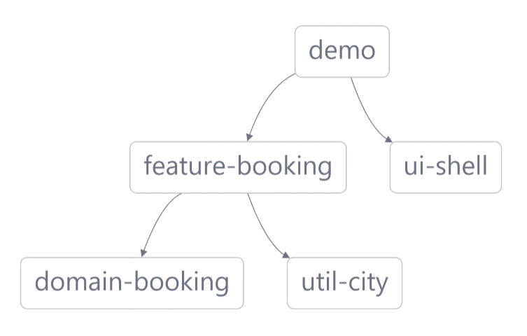
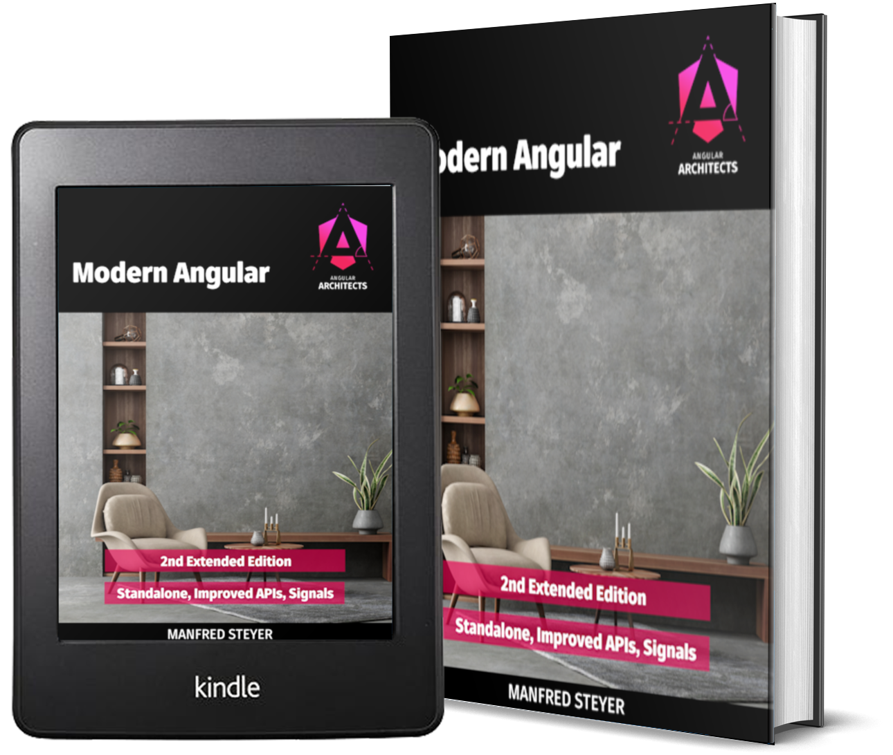

# Architecture with Standalone Components

In last chapter, I've shown how Standalone Components will make our Angular applications more lightweight in the future. In this part, I'm discussing options for improving your architecture with them.

>The **source code** for this can be found in the form of a traditional [Angular CLI workspace](https://github.com/manfredsteyer/standalone-example-cli) and as an [Nx workspace](https://github.com/manfredsteyer/standalone-example-nx) that uses libraries as a replacement for NgModules. 

## Grouping Building Blocks

Unfortunately, the examples shown so far cannot keep up with one aspect of NgModules. Namely the possibility of grouping building blocks that are usually used together. 

Obviously, the easiest approach for grouping stuff that goes together is using folders. However, you might go one step further by leveraging barrels: A barrel is an EcmaScript file that exports related elements.

These files are often called `public-api.ts` or `index.ts`. The example project used contains such an `index.ts` to group two navigation components from the shell folder:

{width=33%}


The barrel itself re-exports the two components:

```typescript
export { NavbarComponent } from './navbar/navbar.component';
export { SidebarComponent } from './sidebar/sidebar.component';
```

The best of this is, you get real modularization: Everything the barrel experts can be used by other parts of your application. Everything else is your secret. You can modify these secrets as you want, as long as the public API defined by your barrel stays backwards compatible. 

In order to use the barrel, just point to it with an `import`:

```typescript
import { 
    NavbarComponent, 
    SidebarComponent 
} from './shell/index';

@Component({
    standalone: true,
    selector: 'app-root',
    imports: [
        RouterOutlet,

        NavbarComponent,
        SidebarComponent,
    ],
    templateUrl: './app.component.html',
    styleUrls: ['./app.component.css']
})
export class AppComponent {
    [...]
}
```

If you call your barrel `index.ts`, you can even omit the file name, as `index` is the default name when configuring the TypeScript compiler to use Node.js-based conventions. Something that is the case in the world of Angular and the CLI:

```typescript
import { 
    NavbarComponent, 
    SidebarComponent 
} from './shell';

@Component({
    standalone: true,
    selector: 'app-root',
    imports: [
        RouterOutlet,

        NavbarComponent,
        SidebarComponent,
    ],
    templateUrl: './app.component.html',
    styleUrls: ['./app.component.css']
})
export class AppComponent {
    [...]
}
```

## Importing Whole Barrels

In the last section, the `NavbarComponent` and the `SidebarComponent` were part of the shell's public API. Nevertheless. Angular doesn't provide a way to import everything a barrel provides at once. 

In most of the cases, this is the totally fine. Auto-imports will add the needed entries anyway, hence this style of programming is easy. Also, being explicit about what you need helps enables tree-shaking. 

However, in some edge-cases where you know that some building blocks **always** go together, e. g. because there is a strong mutual dependency, putting them into an  array can help to make our lives easier. For instance, think about all the directives provided by the FormsModule. Normally, we don't even know their exact names nor which of them play together. 

The following example demonstrates this idea:

```typescript
import { NavbarComponent } from './navbar/navbar.component';
import { SidebarComponent } from './sidebar/sidebar.component';

export { NavbarComponent } from './navbar/navbar.component';
export { SidebarComponent } from './sidebar/sidebar.component';

export const SHELL = [
    NavbarComponent,
    SidebarComponent
];
```

Interestingly, such arrays remind us to the `exports` section of NgModules. Please note that your array needs to be a constant. This is needed because the Angular Compiler uses it already at compile time.

Such arrays can be directly put into the `imports` array. No need for spreading them: 

```typescript
import { SHELL } from './shell';

[...]

@Component({
    standalone: true,
    selector: 'app-root',
    imports: [
        RouterOutlet,

        // NavbarComponent,
        // SidebarComponent,
        SHELL
    ],
    templateUrl: './app.component.html',
    styleUrls: ['./app.component.css']
})
export class AppComponent {
    [...]
}
```

One more time I want to stress out that this array-based style should only be used with caution. While it allows to group things that always go together it also makes your code less tree-shakable.

## Barrels with Pretty Names: Path Mappings

Just using `import` statements that directly point to other parts of your application often leads to long relative and confusing paths: 

```typescript
import { SHELL } from '../../../../shell';

@Component ({
    standalone: true,
    selector: 'app-my-cmp',
    imports: [
        SHELL,
        [...]
    ]
})
export class MyComponent {
}
```
 
To bypass this, you can define path mappings for your  barrels you import from in your TypeScript configuration (`tsconfig.json` in the project's root):
 
```json
"paths": {
 "@demo/shell": ["src/app/shell/index.ts"],
  [...]
}
```
 
This allows direct access to the barrel using a well-defined name without having to worry about - sometimes excessive - relative paths:
 
```typescript
// Import via mapped path:
import { SHELL } from '@demo/shell';

@Component ({
    standalone: true,
    selector: 'app-root',
    imports: [
        SHELL,
        [...]
    ]
})
export class MyComponent {
}
```

## The Next Logical Step: Workspace Libraries and Nx

These path mappings can of course be created manually. However, it is a little easier with the CLI extension [Nx](https://nx.dev/) which automatically generates such path mappings for each library created within a workspace. Libraries seem to be the better solution anyway, especially since they subdivide it more and Nx prevents bypassing the barrel of a library.

This means that every library consists of a public -- actually published -- and a private part. The library’s public and private APIs are also mentioned here. Everything the library exports through its barrel is public. The rest is private and therefore a "secret" of the library that other parts of the application cannot access.

It is precisely these types of "secrets" that are a simple but effective key to stable architectures, especially since everything that is not published can easily be changed afterwards. The public API, on the other hand, should only be changed with care, especially since a breaking change can cause problems in other areas of the project.

An Nx project (workspace) that represents the individual sub-areas of the Angular solution as libraries could use the following structure:

{width=33%}


Each library receives a barrel that reflects the public API. The prefixes in the library names reflect a categorization recommended by the Nx team. For example, feature libraries contain smart components that know the use cases, while UI libraries contain reusable dumb components. The domain library comes with the client-side view of our domain model and the services operating on it, and utility libraries contain general auxiliary functions.

On the basis of such categories, Nx allows the definition of linting rules that prevent undesired access between libraries. For example, you could specify that a domain library should only have access to utility libraries and not to UI libraries:


In addition, Nx allows the dependencies between libraries to be visualized:



If you want to see all of this in action, feel free to have a look at the Nx version of the example used here. Your find the [Source Code at GitHub](https://github.com/manfredsteyer/demo-nx-standalone).

## More on Architectures with Nx

More information about architectures with Nx can be found in our free eBook (12 chapters) on Angular Architectures: 

{width=40%}


Feel free to [download it here](https://www.angulararchitects.io/book) now!

## Conclusion

Standalone Components make the future of Angular applications more lightweight. We don't need NgModules anymore. Instead, we just use EcmaScript modules. This makes Angular solutions more straightforward and lowers the entry barrier into the world of the framework. Thanks to the mental model, which regards standalone components as a combination of a component and a NgModule, this new form of development remains compatible with existing code.

For the grouping of related building blocks, simple barrels are ideal for small solutions. For larger projects, the transition to monorepos as offered by the CLI extension Nx seems to be the next logical step. Libraries subdivide the overall solution here and offer public APIs based on barrels. In addition, dependencies between libraries can be visualized and avoided using linting.

