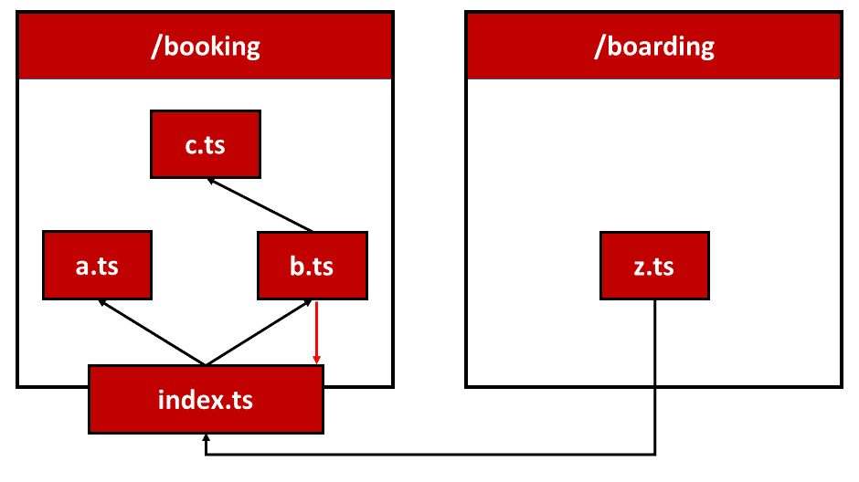
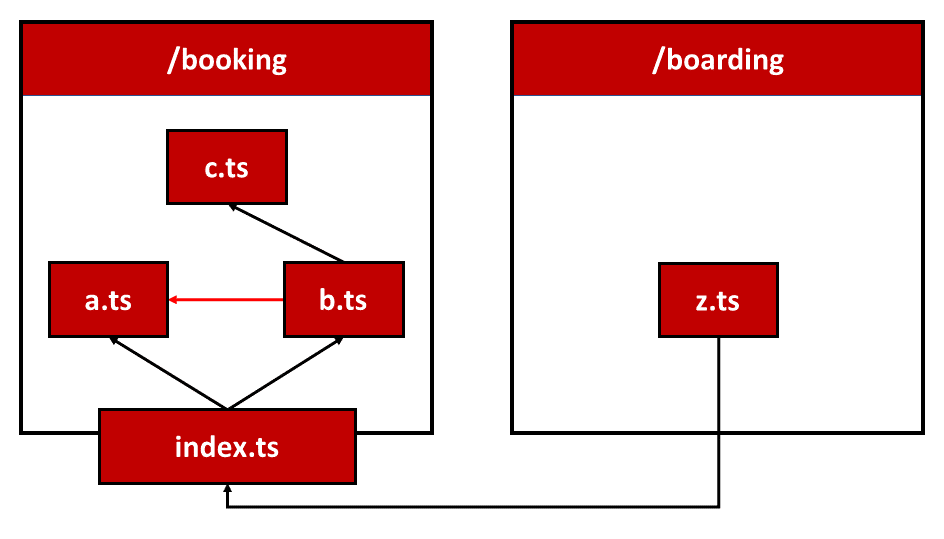
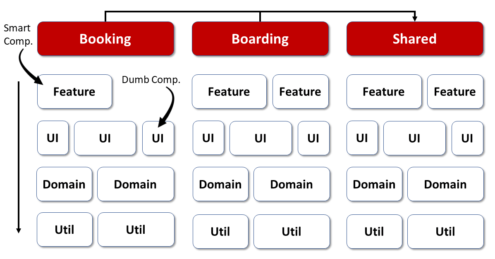
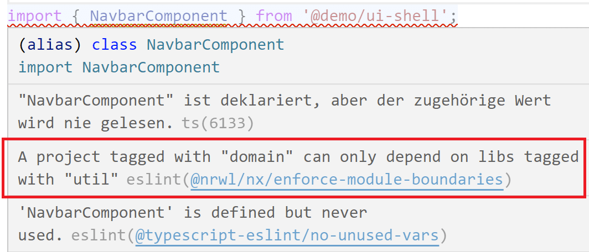
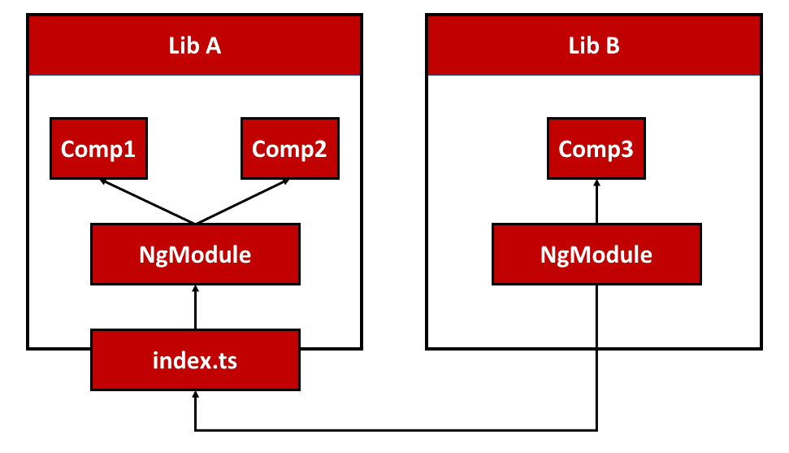
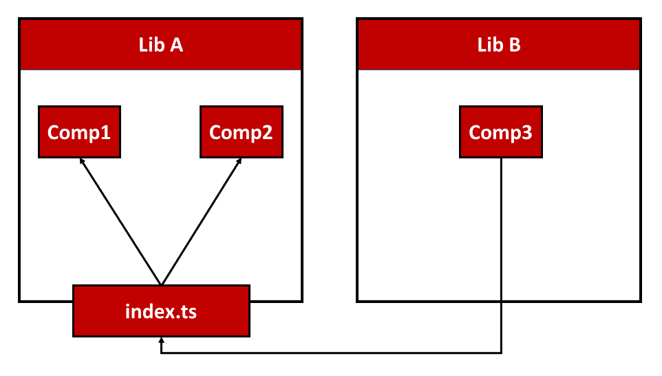

# Migrating for Angular Standalone Components

After getting started with Standalone Components the question arises how to migrate an existing Angular solution for a future without Angular modules. In this chapter I show four options to do so.

## Option 1: Ostrich Strategy

Let's start with the simplest option - the ostrich strategy. Stick your head in the sand and ignore everything around you:

{width=50%}


Even if that sounds smug, there is actually nothing wrong with it. Nobody is forcing us to convert applications to Standalone Components. Angular will continue to support Angular modules. After all, the entire ecosystem is based on it. You can therefore safely ignore Standalone Components or only use this new option in new applications or application parts.

## Option 2: Just Throw Away Angular Modules

This strategy also seems smug at first glance: You simply remove all Angular modules from your source code. This doesn't have to be done in one go either, because Standalone Components play wonderfully together with Angular modules. Angular modules can be imported into Standalone Components and vice versa.

For instance, the following listing shows a Standalone Component importing further NgModules:

```typescript
import { Component, OnInit } from '@angular/core';
import { TicketsModule } from '../tickets/tickets.module';

@Component({
    selector: 'app-next-flight',
    standalone: true,
    imports: [
        // Existing NgModule imported 
        // in this standalone component
        TicketsModule
    ],
    [...]
})
export class NextFlightComponent implements OnInit {
    [...]
}
```

To illustrate the other way round, this listing shows an NgModule importing a Standalone Component:

```typescript
@NgModule({
  imports: [
    CommonModule,

    // Imported Standalone Component:
    FlightCardComponent,
    [...]
  ],
  declarations: [
    MyTicketsComponent
  ],
  [...]
})
export class TicketsModule { }
```

This mutual compatibility is made possible by the [mental model](https://www.angulararchitects.io/en/aktuelles/angulars-future-without-ngmodules-lightweight-solutions-on-top-of-standalone-components/) behind Standalone Components. 

Accordingly, a standalone component is a combination of a component and a module. Even if the actual technical implementation does not set up any dedicated Angular modules, this idea helps to bridge the gap between the two worlds. It also explains why Angular modules and Standalone Components can import each other.

If you go with this strategy, you need to import the compilation context directly into the Standalone Component using its `imports` array. I like to think about this compilation context as about the component's neighbor hood: It contains all other Standalone Components, Standalone Directives, and Standalone Pipes but also NgModules the component in question needs. 

Hopefully, the Angular language service and hence editors/ IDEs like Visual Studio Code or WebStorm/ IntelliJ will provide **auto imports** for this task. To help with this too, my colleague Rainer Hahnekamp wrote a nice [schematic](https://www.npmjs.com/package/@angular-architects/sam4sc) that automates some of the steps needed. Currently, we don't think that full automation is possible here, because for this we need some knowledge about the application. For instance, we need to know which providers are used where.

## Option 3: Replace Angular Modules with Barrels

Barrels are EcmaScript files that (re)export related building blocks:

```typescript
import { NavbarComponent } from './navbar/navbar.component';
import { SidebarComponent } from './sidebar/sidebar.component';
```

The consumer can now import everything the barrel provides:

```typescript
import { NavbarComponent, SidebarComponent } as shell from '../shell';
```

If the barrel is called `index.ts`, it is sufficient to import only the barrel folder. In addition to grouping, this approach also has the advantage that barrels can be used to define **public APIs**: All building blocks exported by the barrel can be used by other parts of the application. They just need to import from the barrel. Everything else is considered an implementation detail that should not be accessed by other application parts. Hence, such implementation details are quite easy to change without producing breaking changes somewhere else. This is a simple but effective measure for stable software architectures.

In a further step, each barrel could also receive a path mapping in the `tsconfig.json`. In this case, the application can access the barrel using nice names similar to npm package names:

```typescript
import { NavbarComponent, SidebarComponent } from '@demo/shell';
```

However, barrels also come with challenges: For example, they are often the cause of **cyclical dependencies**:



Here, `b.ts` on the one hand is referenced by the barrel `index.ts` and on the other hand accesses the barrel.

This problem can be avoided from the start with two simple rules that must be followed consistently:

-	A barrel may only publish elements from its "area". The "area" extends over the barrel's folder as well as its subfolders.
-	Within each "area", files reference each other using relative paths without using the barrel.

Although these rules sound a bit abstract at first glance, the implementation of this rule is easier than you would think:



Here, `b.ts` directly accesses `a.ts` located in the same "area" to avoid the cycle shown earlier. The detour the barrel is avoided.

Another disadvantage is that each part of the program can bypass the specified barrels - and thus the public API created with them. Relative paths to private parts of the respective "areas" are sufficient for this.

This problem can be solved with linting. A linting rule would have to detect and denounce unauthorized access. The popular tool [Nx](https://www.angulararchitects.io/en/aktuelles/tutorial-first-steps-with-nx-and-angular-architecture/) comes with such a rule, which can also be used to prevent other unwanted accesses. The next section takes up this idea.

## Option 4: Nx Workspace with Libraries and Linting Rules

The popular tool [Nx](https://www.angulararchitects.io/en/aktuelles/tutorial-first-steps-with-nx-and-angular-architecture/) is based on the Angular CLI and brings a lot of convenience for developing enterprise-scale solutions. Nx allows a large project to be broken down into different applications and libraries. Each library has a public API that specifies a barrel named `index.ts`. Nx also provides path mapping for all libraries. In addition, Nx brings a linting rule that prevents bypassing the barrel and also allows other restrictions.

This linting rule allows enforcing a fixed frontend architecture. For example, the Nx team recommends dividing a large application vertically by subject domains and horizontally by technical library categories:



Feature libraries contain smart components that implement use cases, while UI libraries house reusable dump components. Domain libraries encapsulate the client-side domain model and services that operate on it, and utility libraries group general utility functions. 

With the linting rules mentioned, it can now be ensured that each layer may only access the layers below it. Access to other domains can also be prevented. Libraries from the _Booking_ area are therefore not allowed to access libraries in _Boarding_. If you want to use certain constructs across domains, they should be placed in the shared area, for example.

If someone violates one of these rules, the linter gives instant feedback:



The folder structure used for this by Nx reflects the architecture matrix shown: 

{width=33%}


The subfolders in libs represent the domains. The libraries found in it get a prefix like `feature-` or `domain-`. These prefixes reflect the technical categories and thus the layers.

The nice thing about this fourth option is that it has long proven itself in interaction with Angular modules for structuring large solutions:



Thanks to Standalone Components, the Angular modules can be omitted now: 



In this case, only the libraries are used for structuring: their barrels group related building blocks, such as Standalone Components, and thanks to the linting rules mentioned, we can enforce our architectures.

## More on Architectures with Nx

More information about architectures with Nx can be found in our free eBook (12 chapters) on Angular Architectures: 

{width=50%}


Feel free to [download it here](https://www.angulararchitects.io/book) now!